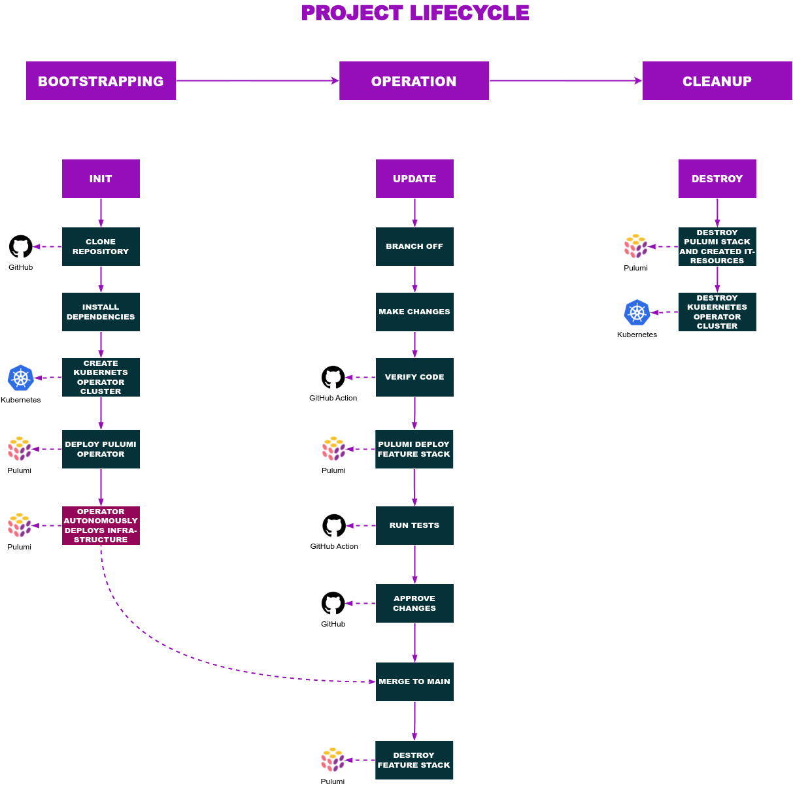

# Whopper

!!! Project under active development !!!

Overview: ...

---

## Installation and project setup

Before creating the infrastructure and start processing articles make sure to walk over the following sections of this chapter.
- [Whopper](#whopper)
  - [Installation and project setup](#installation-and-project-setup)
    - [Required installations](#required-installations)
    - [Used environment variables](#used-environment-variables)
    - [Install local dependencies](#install-local-dependencies)
  - [Project lifecycle](#project-lifecycle)
    - [Bootstrapping](#bootstrapping)
    - [Operation Phase](#operation-phase)
    - [Cleanup](#cleanup)

After that go a head to the next chapter [Project lifecycle](#project-lifecycle).

### Required installations

-  `go` for application logic is used: [installation guide](https://go.dev/doc/install)
-  `pulumi` as infrastructure as code (IaC) tool is used: [installation guide](https://www.pulumi.com/docs/get-started/install/)
-  `node` and `npm` is used to describe Pulumi IaC: [installation guide](https://nodejs.org/en/download/)
-  `gcloud` CLI is used to access resources created in gcp: [installation guide](https://cloud.google.com/sdk/docs/install), Make sure to run `gcloud init` & `gcloud auth application-default login`
-  `kubectl` is used to interact with created kubernetes clusters: [installation guide](https://kubernetes.io/docs/tasks/tools/)
-  `task` is used instead of a makefile to install, verify, build and in general maintain the project: [installation guide](https://taskfile.dev/#/installation)
-  `protoc` is used to compile proto3 api file: [installation guide](https://grpc.io/docs/protoc-installation/)
   -  `protoc-gen-go`: `$ go install google.golang.org/protobuf/cmd/protoc-gen-go@latest` [gPRC quickstart](https://grpc.io/docs/languages/go/quickstart/)
   -  `protoc-gen-go-grpc`: `$ go install google.golang.org/grpc/cmd/protoc-gen-go-grpc@v1.1` [gPRC quickstart](https://grpc.io/docs/languages/go/quickstart/)


You can check if installations are met by running `sh ./scripts/check-installations.sh` or `task verify:check`.

```
$ task -l
task: Available tasks for this project:
* deploy:pull-whopper-config: Pull kubeconfig to access whopper cluster
* deploy:whopper: 		        Deploy whopper infrastructure with pulumi
* destroy:cleanup-project: 	  Delete all created it resources
* destroy:whopper: 		        Destroy the whopper infrastructure
* init-project: 		          Initialize project for production
* kubectl-o: 			            kubectl wrapper to interact with operator cluster
* kubectl-w: 			            kubectl wrapper to interact with the whopper cluster
* scan:whopper-cluster: 	    Kubernetes cluster scan
* test:whopper-cluster: 	    Whopper kubernets tests
* verify-project: 		        Run all checks to verify project quality
* verify:code: 			          Verify project code
* verify:go: 			            Verify project golang code
* verify:install: 		        Install and update project dependencies
* verify:ts: 			            Verify project typescript code
```

Additional information can be get by setting the `--summary` flag.

Example:

```
$ task --summary verify:go
task: verify:go

Verify project golang code

commands:
 - Task: verify:check-go-build
 - Task: verify:check-go-mod
 - Task: verify:check-golangci-lint
 - Task: verify:test-go-unit
```
### Used environment variables

A couple of environment variables are **required**.

- Export you pulumi access token as environment variable `PULUMI_ACCESS_TOKEN`.
- Make sure `GOPATH` is set. It usually points to `/home/<user>/go`
- Set `DEFAULT_GOOGLE_PROJECT` to your GCP profile id

### Install local dependencies

**!! Does not work on Windows !!** I suggest using Linux or Macos. You can spin up virtual linux machine using [VirtualBox](https://www.virtualbox.org/wiki/Downloads) or any other virtualization tool.

To install depenencies locally use the task file run `task verify:install`
This will do the following this for you:
- Install go libraries
- Install npm libraries locally
- Clone project [googleapi]() which is used to build parts of the whopper api (see [api proto3 file](./api/whopper.proto))
- Compile proto3 golang code

---

## Project lifecycle

The lifecycle of this project is desirbed in more detail in one of the docs documents [see docs/project-lifecycle](./docs/project-lifecylce-phases.md).



A brief summary of each phase is given in the sections:
- [Bootstrapping](#bootstrapping)
- [Operation Phase](#operation-phase)
- [Cleanup](#cleanup)

### Bootstrapping
Setup infrastructure for the fist time.
There are two different types of infrastructure deployments. 

1. **Production deployment**: The production deployment is on going and uses the pulumi kubernetes operator. The operator watches the `main` branch for updates. Production infrastructure is build to stay with rolling blue-green updates. The task `task init-project` is used to set up the project inititially.
2. **Feature test deployment**: The feature test deployment is a short term infrastructure test. It is used whenever a commit is pushed to any other branch then main. The infrastructure is deployed, tested and then destroyed. If these phases succeed without any error the feature is considered "bug free" and can be merged to `main`. The task `task deploy:whopper` can be used to deploy the whopper infrastructure to a pulumi stack with the name of the current branch.

### Operation Phase
operation

```bash
TODO: ...
```


### Cleanup

Tasks available to clean up the infrastructure:
* `task destroy:cleanup-project` to destroy the `main` project including the whopper infrastructure with the pulumi operator and the operator cluster.  
* `task destroy:whopper` to the destroy the whopper infrastructure with the stack name of the current branch.


> More information can be found in the `/docs` folder.  