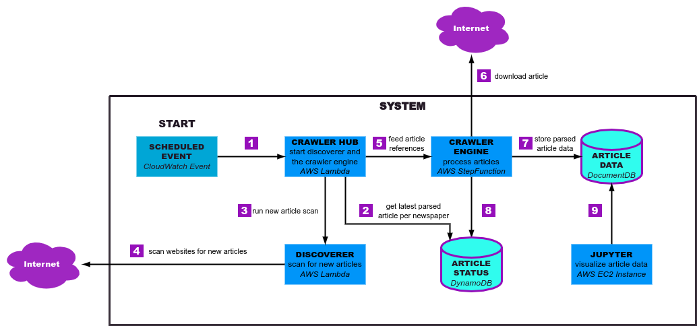

# Climate Whopper

!!! Project under active development !!!

TODO: README...

Overview: ...

## Getting started

Required installations:

-   Pods are written in `go`: [installation guide]()
-   To manage infrastructure `pulumi` is used: [installation guide]()
-   Pulumi uses `node`: [installation guide]()
-   As this project uses GCP the CLI `gcloud` is used: [installation guide]()
-   To interact with the kubernetes cluster `kubectl` is used: [installation guide]()
-   `dapr` is used as well: [installation guide]()

Export you pulumi access token as environment variable (only needed once at startup) .

To check if all application have been downloaded you can run:

```bash
TODO: ...
make install-verify
```

To install all project dependencies you can run:

```bash
TODO: ...
make install
```

## Prerequesits


## How to use it

### Bootstrapping
setup system for the first time 

```bash
export PULUMI_ACCESS_TOKEN=pul-XYZXYZXYZXYZXYZXYZ
task init-pulumi-project 
go get ./...
```

### System updates
operation

```bash
TODO: ...
```

To access kubernetes cluster 

### Cleanup
destroy created it resources

```bash
TODO: ...
```

clone googleapis to be able to compile the `./api/whopper.proto` file
TODO: explanation: as the whopper system is using google cloud services to run analytics, the analytics response works directly with that ...

```bash
git clone https://github.com/googleapis/googleapis $GOPATH/googleapis
```

2. Login to google cloud via the `gcloud` CLI

```bash
gcloud auth login
# if you don't have project yet, create one
gcloud config set project <YOUR_GCP_PROJECT_HERE>
gcloud auth application-default login
```

3. Configure project (see Configuration section)
4. Deployment (see Deployment section)

### Configuration

The project can be configured infrastructure and application wise.

#### Infrastructure configuration

TODO: ...Infrastructure configuration

The infrastructure uses pulumi and therefore the provided pulumi configuration.

gcloud config set project <GCP-PROJECT-ID>

To get kubernetes credentials you can run

```bash
gcloud container clusters get-credentials <cluster> --zone <cluster zone> --project <gcp project>
```

#### Application configuration

TODO: ...Application configuration

### Deployment

#### Local testing

#### Deployment

## Architecture

The architecture is shown in multiple diagrams to provide different level of complexity and the opportunity to highlight different parts of the system.

### Component overview

As this system has been reconstructed from an AWS Project, first the AWS components will be given.
The following diagram shows the overall system architecture of the AWS system. To understand the interaction between the components, arrows have been provided with numbers showing a flow (1..9), after the diagram follows an explanation point by point.



1. After a scheduled routine the crawler hub starts
2. To avoid scanning the entire newspaper website the latest newspaper article will be provided as stopping point
3. The crawler hub notifies the discoverer to scan a newspaper website. One call per newspaper website
4. The discoverer scrapes a newspaper website and checks stores all articles that has been published since the latest article
5. New unprocessed articles are getting feed into the crawler engine
6. Download raw html article from newspaper website
7. After article processing is over the data will be stored in the article data, database
8. The article status will be updated to avoid processing the article multiple times
9. The data representation can call async the article data for visualization

As this diagram just shows the AWS components the next diagram will show the cloud native artictecture components.

### Cloud Native architecture

TODO:...

## Project structure

Now as the overall project idea and architecture has been discussed. The project structure will be highligted to support navigating through the project.

TODO: ...Project structure (tree)

## Local testing

TODO: ...local testing
