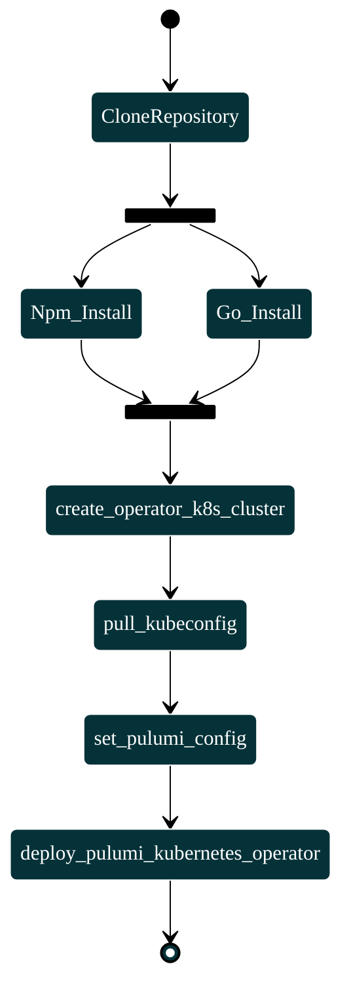
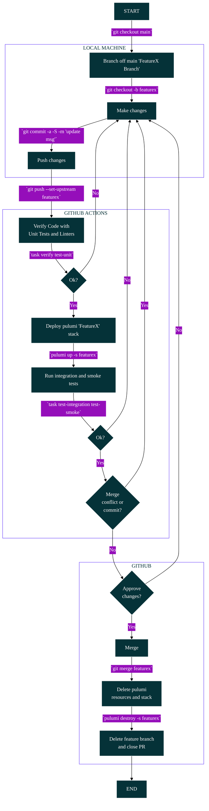
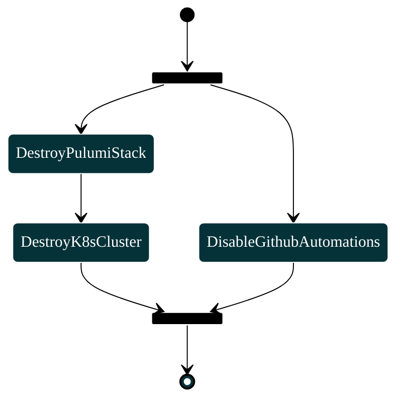

## Project lifecycle
The project is divided into three major lifecycle phases. 
1. During the bootstrapping phase, the project infrastructure and services are set up. The phase is completed when the system can be used normally for the first time.
2. In the second phase, the operational phase, the system is used after the initial setup. During this phase, the infrastructure and the system are used and managed (including updates).
3. The last phase, the clean-up phase, is initiated when the entire project system is deleted. The phase is complete when all resources initially deployed and after updates across the infrastructure systems in use have been deleted.

A general overview is provided below.

...
TODO: add project lifecycle overview

The phases are described in the next chapters with additional diagrams.

Translated with www.DeepL.com/Translator (free version)

## Bootstrapping Phase

TODO: walk over the steps one by one

## Operation Phase

TODO: walk over the steps one by one

## Cleanup

TODO: walk over the steps one by one